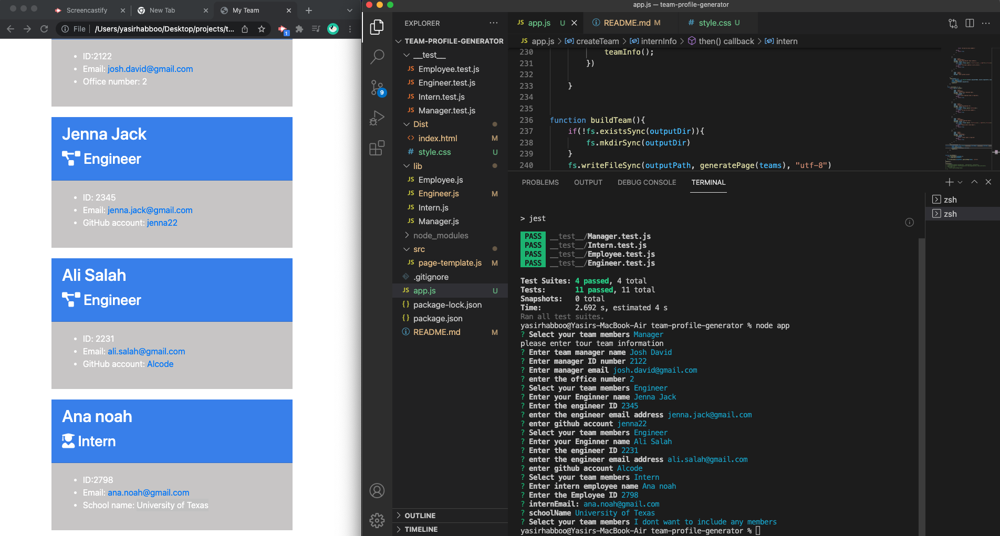

# team-profile-generator
an application to gather employee information, once the application is launched a series of questions will prompt to the users for selecting the employee role and entring the employee information once the user finishes the information the app will pass the data to the page template to build the website with all the information. 

# Technology used for designing the application 
the app designed by using node.js, inquirer.js, and OOP to gather and generate employee information 

# Installation

 To install necessary dependencies, run the following command
====================
     npm install
====================

# Instructions
        
Instructions to be followed 

for more information please visit https://docs.npmjs.com/cli/v8/commands/npm-install

# usage
 using the app requires using the CLI

# video to demonstrate the app
https://watch.screencastify.com/v/UwcoM50fuy2G8Un1cxTU

 
